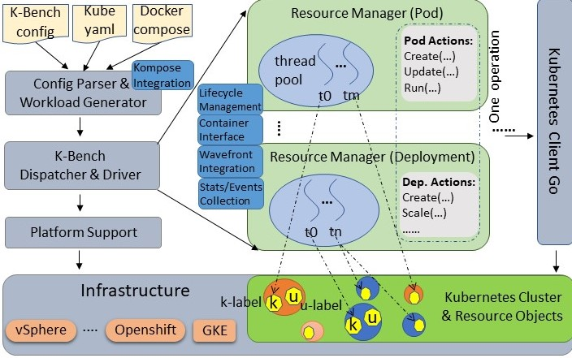

# K-Bench

(`K-Bench`) is a framework to benchmark the control and data plane aspects of a
Kubernetes infrastructure. K-Bench provides a configurable way to prescriptively create and
manipulate Kubernetes resources at scale and eventually provide the relevant control plane
and dataplane performance metrics for the target infrastructure. Example operations include
CREATE, UPDATE, LIST, DELETE, RUN, COPY etc. on different types of `Kubernetes` resources
including `Pod`, `Deployment`, `Service`, `ReplicationController`, etc.

`K-Bench has the following features:

* It allows users to control the client side concurrency, the operations, and how these different 
types of operations are executed in sequence or in parallel. In particular, user can 
define, through a config file, a workflow of operations for supported resources. User
can also specify parameters such as image for `Pod`, number of replicas for `Deployment`, etc. 
* For control-plane (life-cycle management) performance, the benchmark complements the
server-side timing adopted in many other existing benchmarks with a client-side approach,
based on Kubernetes' event callback mechanism. This addressed the coarse-grained timestamp
issue on the server-side and enhanced the measuing precision.
* K-Bench also includes benchmarks built into it, which allows users to study the data plane 
performance by independently scaling up and scaling out infrastructure resource usage 
in terms of compute, memory, I/O and network. The framework comes with blueprints for running 
these benchmarks in various ways at scale to evaluate specific aspects of a K8s infrastructure.
For E.g., one can use the integrated dp_network_internode test to automatically place two pods
on two different K8s nodes to measure inter-pod network latency and bandwidth. 
* It supports docker compose files and convert them into Kubernetes spec files.
* It is integrated with [Prometheus](https://github.com/coreos/kube-prometheus), which can be
enabled by simply including prometheus configuration options in the benchmark config file. 
K-Bench also supports [Wavefront](https://www.wavefront.com), an enterprise-grade data analytic 
and monitoring platform.

## Architecture


The above diagram shows an overview of the benchmark. Upon starting, a json config file
is parsed for infrastructure and operation information. Then a sequence of _operations_
are generated, each of which may contain a list of _actions_ such as _create_, _list_,
_scale_, etc. The operations run one by one, optionally in a blocking manner. Actions inside
one operation, however, run in parallel with Go routines. Actions supported for different
types of resources are defined in their respective _managers_. The resource managers
also provide metrics collection mechanism and produce [Wavefront](https://www.wavefront.com)
consumable data. The benchmark uses `client-go` to communicate with the `Kubernetes` cluster.

K-Bench can be extremely flexible in that it allows virtually any supported actions performed
with user chosen parameters on selected resource objects serially, in parallel, or in a
hybrid manner. To achieve this, a crucial problem to address is to determine how actions
and resources are handled or partitioned by different threads. We call this workload dispatch.
In K-Bench,  dispatch for actions is straightforward: the configuration parser scans the
entire config file and determines the maximum concurrency for each operation by summing up all
the `Count` fields of different resource types in the operation. The dispatcher spawns and
maintains all go routines so that corresponding actions of different types of resources in
an operation are fully parallelized. Different actions for the same resource in the operation
share the same go routine and are executed in order.  To achieve dispatch for resource objects,
K-Bench maintains two types of labels, namely `k-label` and `u-label` respectively, for each
resource object. K-Bench assigns each go routine a TID and an operation an OID, which are also
attached as k-label to the relevant objects. Other metadata such as resource type, app name,
benchmark name, etc., are also attached as k-label when a resource is created. K-Bench provides
predefined label matching options such as MATCH_GOROUTINE, MATCH_OPERATION to select objects
created by a specified routine in certain operations. Users labels passed through the
benchmark configuration specification are attached to resources as u-labels, which can be
also used for resource dispatch.

## Control Plane Metrics

After a successful run, the benchmark reports metrics (e.g., number of requests, API invoke
latency, throughput, etc.) for the executed operations on various resource types. One resource
type whose metrics need special consideration is `Pod`, as its operations are typically long-running
and asynchronous. For `Pod` (and related resource types such as `Deployment`), we introduce
two sets of metrics, server-side and client-side, to better summarize its performance from different
perspectives. The server-side metrics design for `Pod` in K-Bench inherits the definition suggested
by the [kubernetes sig group](https://github.com/kubernetes/community/tree/master/sig-scalability)
(the exact way those `Pod` metrics are defined can be revealed from the density and performance
test in the e2e: [density_test.go](https://github.com/kubernetes/kubernetes/blob/master/test/e2e_node/density_test.go)).
The client-side set of metrics, collected by an event callback mechanism, is a more accurate
reflection on the time taken for `Pod` states transition end-to-end. The below table describes all
the supported metrics:
 

| Metric [^1] |  Definition | Applied Resource Type  | Notes & References & Sources |
| ------ | ------ | ------ | ------ |
| Pod creation latency (server) | *scheEvent.FirstTimestamp* (the FirstTimestamp of a scheduling event associated with a pod) - *pod.CreationTimestamp* (the CreationTimestamp of the pod object) | Pod Deployment | [density.go](https://github.com/kubernetes/kubernetes/blob/master/test/e2e_node/density_test.go) |
| Pod scheduling latency (server) | *pod.Status.StartTime* (the server timestamp indicating when a pod is accepted by kubelet but image not pulled yet) - *scheEvent.FirstTimestamp* (the first timestamp of a scheduled event related to a pod) | Pod Deployment | [density.go](https://github.com/kubernetes/kubernetes/blob/master/test/e2e_node/density_test.go) |
| Pod image pulling latency (server) | *pulledEvent.FirstTimestamp* (the FirstTimestamp of an event with "Pulled" as the reason associated with a pod) - *pod.Status.StartTime* (the timestamp indicating when a pod is accepted by kubelet but image not pulled yet) | Pod Deployment | a new metric defined in [pod_manager.go](./manager/pod_manager.go) for kbench |
| Pod starting latency (server) | *max(pod.Status.ContainerStatuses[...].State.Running.StartedAt)* (the StartedAt timestamp for the last container that gets into running state inside a pod) - *pulledEvent.FirstTimestamp* (the FirstTimestamp of an event with "Pulled" as the reason associated with a pod) | Pod Deployment | [density.go](https://github.com/kubernetes/kubernetes/blob/master/test/e2e_node/density_test.go) |
| Pod startup total latency (server) | *max(pod.Status.ContainerStatuses[...].State.Running.StartedAt)* (the StartedAt timestamp for the last container that gets into running state inside a pod) - *pod.CreationTimestamp* (the CreationTimestamp of the pod object) | Pod Deployment | [density.go](https://github.com/kubernetes/kubernetes/blob/master/test/e2e_node/density_test.go) |
| Pod client-server e2e latency | *the first time when client watches that pod.Status.Phase becomes running* - *pod.CreationTimestamp* (the server-side CreationTimestamp of the pod object) | Pod Deployment | this is similar to the ["watch" latency in e2e test](https://github.com/kubernetes/kubernetes/blob/master/test/e2e_node/density_test.go) |
| Pod scheduling latency (client) | *the first time when client watches that pod.Status.Conditions[...] has a PodScheduled condition* - *the first time client watches the pod* (and thus does not have a PodScheduled condition) | Pod Deployment | a new metric defined in [pod_manager.go](./manager/pod_manager.go) in kbench |
| Pod initialization latency (client) | *the first time when client watches that pod.Status.Conditions[...] has a PodInitialized condition* - *the first time when client watches that pod.Status.Conditions[...] has a PodScheduled condition* | Pod Deployment | a new metric defined in [pod_manager.go](./manager/pod_manager.go) in kbench |
| Pod starting latency (client) | *the first time when client watches that pod.Status.Phase becomes running* - *the first time when client watches that pod.Status.Conditions[...] has a PodInitialized condition* | Pod Deployment | a new metric defined in [pod_manager.go](./manager/pod_manager.go) **Note that there is no client-side watch event for image pulling, so this metric includes the image pulling.** |
| Pod startup total latency (client) | *the first time when client watches that pod.Status.Phase becomes running* - *the first time client watches the pod* (and thus does not have a PodScheduled condition) | Pod Deployment | a new metric defined in [pod_manager.go](./manager/pod_manager.go) |
| Pod creation throughput | *sum(number of running pods of every operation that has pod actions / 2)* / *sum(median Pod startup total latency of every operation that has pod actions)* | Pod Deployment | a new metric defined in [pod_manager.go](./manager/pod_manager.go). |
| API invoke latency | *latency for an API to return* | All resource types | a new metric defined in [pod_manager.go](./manager/pod_manager.go). |

[^1]: For each latency related metric, there are four values reported: median, min, max, and 99-percentile.

## Data Plane Workloads and Metrics

| Metric [^1] |  Resource Category | Benchmark  | Notes |
| ------ | ------ | ------ | ------ |
| Transaction throughput | CPU/Memory | Redis Memtier | Maximum achievable throughput under tight latency constraints | 
| Transaction latency | CPU/Memory | Redis Memtier | Latency percentiles |
| I/O bandwidth (IOPS) | I/O | FIO | Synchronous and Asynchronous Rd/Wr bandwidth for 70-30, 100-0 and 0-100 read-write ratios, block sizes on various K8s volumes |
| I/O Latency (ms) | I/O | Ioping | Disk I/O latency on Ephemeral and Persistent K8s volumes |
| Network b/w | Network | Iperf3 | Inter-pod TCP, UDP performance with varying pod placements on nodes, zones, regions |
| Network Latency (ms) | Network | Qperf | Inter-pod network latency for TCP and UDP packets with varying pod placements |

## Infrastructure Diagnostic Telemetry

In addition to the above metrics that the benchmark reports, K-Bench can be configured to report
Wavefront- and Prometheus-defined metrics that include: memory, CPU, storage utilization of nodes,
namespaces, pods, cluster level statistics, bytes transferred and received rates between pods, uptime,
infrastructure statistics, etc.

To use Wavefront monitoring of the nodes, one can install the Waverunner component using pkg/waverunner/install.sh.
Invoking this script without any parameters will give the help menu. To start telemetry, invoke pkg/waverunner/WR_wcpwrapper.sh as follows:

```
./WR_wcpwrapper.sh -r <run_tag> -i <Host_IP_String> -w <Wavefront_source> [-o <output_folder> -k <ssh_key_file> -p <host_passwd>]
```

The above command defaults to /tmp for output folder and a null host password.

To use Prometheus as your metrics monitoring mechanism, configure the _PrometheusManifestPaths_  option in
the K-Bench config file. Please see [top level configuration options](#top-level-configuration-options) section
below and [prometheus readme](./pkg/prometheus/README.md).

## K-Bench Quickstart Guide

To use K-Bench, clone this repo, install the benchmark, and then you can use it to run workload against
your k8s cluster by following the below instructions.

### Install using Script

On a Linux box (tested on Ubuntu 16.04), just invoke:

```
./install.sh
```

to install the benchmark. 

If you would like the kbench binary to be copied to /usr/local/bin so that you can directly run
without specifying the full kbench path, run it with _sudo_.

### Run the Benchmark

Once the installation completes, you can start using K-Bench. To run the benchmark, you need to make sure your 
_~/.kube/config_ file points to a valid and running `Kubernetes` cluster. To verify this, you may install 
 kubectl (or if you already have it installed) and simply run:

```
kubectl get nodes
```
Once you verify that you have a running `Kubernetes` cluster, the workload can be run directly using the kbench go binary or using the run.sh script. The default benchmark config file ./config/default/config.json specifies the workload you would like to run. You can modify the config file to run workload of your choice. After that, simply run:

```
kbench
```
or
```
./run.sh
```

If your config file is at a different location, please use _-benchconfig_ option if invoking the kbench binary directly:
```
kbench -benchconfig filepath
```
If your filepath is a directory, the benchmark will run them one by one.

When using the run.sh script, invoking this script with -h provides the following help:

```
Usage: ./run.sh -r <run-tag> [-t <comma-separated-tests> -o <output-dir>]
Example: ./run.sh -r "kbench-run-on-XYZ-cluster"  -t "heavy16,netperf,fio" -o "./"

Valid test names:

all || all_control_plane || all_data_plane || cp_heavy_12client || cp_heavy_8client || cp_light_1client || cp_light_4client || default || dp_fio || dp_network_internode || dp_network_intranode || dp_redis || predicate_example
```

To get details about each of the existing workloads, please check the individual README or config.json in config/\<test-name\> folder.  For more details about how to configure workload, please check the examples under the ./config directory, or read the _benchmark configuration_ section of this document. 
 
### Adding a new test to use with run.sh
Add a new folder in config/\<test-name\>, include the run configuration as config/\<test-name\>/config.json and run the test with by providing the \<test-name\> as input to the -t option of run.sh


### Alternative Installing Method: Install Manually with Go (old way with GOROOT and GOPATH)

First, you need to setup your `Go` environment. Download `Go` and unzip it to a local directory
(e.g., _/root/go_) and point your `GOROOT` environment variable there. Also, set your `GOPATH`
(e.g., _/root/gocode_). The below instructions are example for your reference (assuming you download
`Go` to _/root/go_):

```
cd /root/go

gunzip go***.linux-amd64.tar.gz

tar -xvf go***.linux-amd64.tar

mkdir /root/gocode && cd gocode/

export GOPATH=/root/gocode

export GOROOT=/root/go

export PATH=$PATH:/root/go/bin
```

Clone or download benchmark source code to _$GOPATH/src/k-bench_ (create this directory if it
does not exist) using `Git` or through other means.

```
mkdir -p $GOPATH/src

mkdir -p $GOPATH/src/k-bench

```
After you have all the files under _$GOPATH/src/k-bench_, _cd_ to that directory.

It is also handy to include into your _PATH_ variable locations where `Go` typically places and
finds binaries and tools:

```
export PATH=$PATH:$GOROOT/bin:$GOPATH/bin
```
Now, you are ready to build the benchmark. To build, you can either use the below command to
install the `kbench` binary it into _$GOPATH/bin_:

```
go install cmd/kbench.go
```
or run (under the _$GOPATH/src/k-bench_ directory) the below to generate the `kbench` executable
under _$GOPATH/src/k-bench/bin_:

```
mkdir -p bin && cd bin && go build k-bench/cmd/kbench.go
```

## Benchmark Configuration
The benchmark is highly configurable through a json config file. The ./config/default/config.json file is
provided as an example (this file is also the default benchmark config file if user does not specify
one through the _-benchconfig_ option). More config examples can be found under the ./config directory
and its subdirectories.

### Top Level Configuration Options
At top level, the benchmark supports the following configuration options:

* _BlockingLevel_: Currently can be configured as "operation", so that the benchmark waits (for pod
creation and deletion) until the previous operation is completely done before executing the next. If
this option is not specified, the benchmark only waits the specified sleep time after each action and
then proceeds to the next operation, even if there are outstanding actions in the previous operation.
* _Timeout_: Used with BlockingLevel. This is the longest time in mini-seconds for the benchmark to
wait after each operation if BlockingLevel is specified. By default it is 3 minutes.
* _CheckingInterval_: The time interval in mini-seconds to check whether all the actions in the previous
operation complete. By default it is 3 seconds.
* _Cleanup_: Whether clearing all the created resources after a run completes. By default it is false.
* _Operations_: This is an array of operation structures, each of which can contain a list of resource
action configurations. Each resource action configuration includes information such as resource type,
actions (a list of actions to be performed in order), count (number of actions to be executed in parallel),
sleeptimes (time to sleep after each parallel batch of actions), image to use, etc. For details please
refer to below [Operation Configuration](#operation-configuration).
* _RuntimeInMinutes_: The time in minutes that benchmark should run. If all the configured operations
are completed but time elapsed hasn't reached the specified time, the benchmark will loop over and run
the configured operations again.
* _PrometheusManifestPaths_: This option, if configured, installs and enables prometheus stack for cluster 
monitoring. See [prometheus readme](./pkg/prometheus/README.md) for details.
* _WavefrontPathDir_: This option tells the benchmark where to store Wavefront output logs.
* _SleepTimeAfterRun_: In case user wants to add sleep time after each run, this is the option to use.
* _Tags_: If specified, the wavefront output and logs will be tagged with the given keys and values.

### Operation Configuration
In each operation of the _"Operations"_ array, users can specify one or more resource types, and each
resource type can have a list of actions to perform, and each action may accept some options. Below
are example (and a subset of all supported) resource types with the corresponding actions and options:

* _Pods_: Pod resource supports "CREATE", "LIST", "GET", "RUN", "COPY", "UPDATE", and "DELETE" actions.
For the CREATE action, users can specify operation options including "ImagePullPolicy" (where you can
specify one of "IfNotPresent", "Always", and "Never"), "Image", etc. Also, if user specifies a "YamlSpec"
option, then the CREATE action will first try to use the yaml file to create the Pod before using other
explicit options such as "ImagePullPolicy" and "Image". For the RUN action, user can provide the "Command"
option, which is the command to be executed in the specified Pod(s). For COPY action, user can specify
LocalPath, ContainerPath, and Upload options. Certain Pod actions (LIST, RUN, COPY) can be applied to a
selected/filtered list of Pods using the LabelKey and LabelValue options. For all pod actions, "Count"
option specifies the concurrency and "SleepTime" specifies the sleep time user would like to incur after
each action.
* _Deployments_: Deployment resource type supports all the options that Pod does, and in addition it
also supports "SCALE" action and "NumReplicas" option for its CREATE action. Currently it does not
support "RUN" and "COPY" action yet.
* _Namespaces_: Namespace resource type supports "CREATE", "LIST", "GET", "UPDATE", and  "DELETE"
actions. It has "Count" option (number of namespace actions to be performed in parallel), similar to
all the above resource types.
* _Services_: Service resource type supports "CREATE", "LIST", "GET", "UPDATE", and "DELETE" actions.
It has "SleepTimes", "Count", and "YamlSpec" options.
* _ReplicationControllers_: ReplicationController resource type supports the same options and actions
as Deployment.

The benchmark also supports other resource types including _ConfigMap, Event, Endpoints, ComponentStatus,
Node, LimitRange, PersistentVolume, PersistentVolumeClaim, PodTemplate, ResourceQuota, Secret, ServiceAccount,
Role, RoleBinding, ClusterRole, ClusterRoleBinding_, etc.

In addition to different types of resource types, in an operation you can also specify a _RepeatTimes_
option to run the operation for a given number of times.

For more supported resources, actions, and configuration options in K-Bench, please checkout the sample
config files under ./config or source code.

### Operation Predicate
To simplify synchronization and orchestrate operation execution flow, the benchmark supports _Predicate_,
which blocks an operation's execution until certain conditions are met. A predicate is configured through
the below options:

* _Resource_: It has two possible formats:  _namespace/kind/[object name/][container name]_, or
_group/version/namespaces/namespace/kind/[object name/][container name]_.  With the first format, 
you specify a namespace, a kubernetes resource kind, optionally with an object name and a container name
(only valid if the resource kind is Pod). The benchmark will search resources with default kubernetes
group ("") and API version (v1). With the second format, the benchmark will search resource using the
given group, kind, and version. Once this predicate (called a resource predicate) is specified, the
matched resource must exist before the operation can be executed. If a container name is specified, the 
corresponding pod has to be in _Running_ phase in order for the operation to proceed.
* _Labels_: Labels has format of _key1=value1;key2=value2;..._. Labels are used if only namespace and kind
are given in the _Resource_ option to filter resource objects.
* _Command_: This predicate executes a command (inside the container if a container name is specified
in the _Resource_ option, or on the box where the bencmark is invoked). It works with _Expect_ below.
* _Expect_: This option currently supports formats such as _contains:string_ or _!contains:string_. With
this option configured, the benchmark checks the output of the Command execution, and proceed only if
the output is expected.

For examples on how to use predicates, you may check config file samples under ./config/predicate\_example.

## Contributing to the Benchmark 

Please contact the project members and read CONTRIBUTING.md if you are interested in making contributions.
